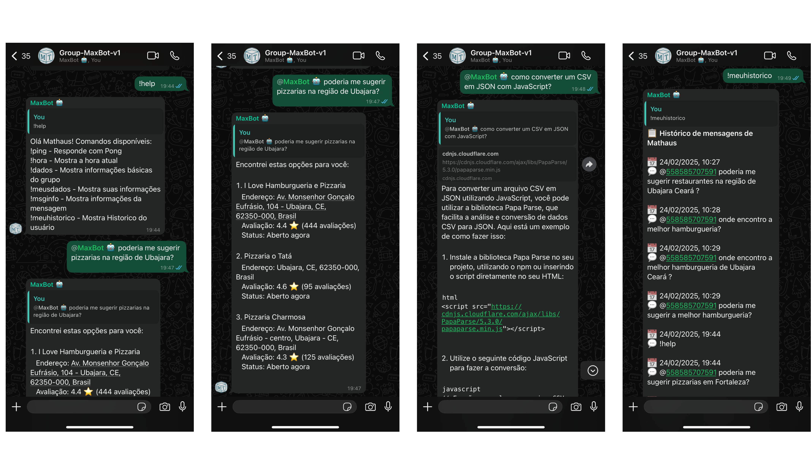

# MaxBot 🤖 
# Chatbot Inteligente para WhatsApp com ML e NLP

[](https://github.com/mathauscm/MaxBot-v1)
[](https://github.com/mathauscm/MaxBot-v1)
[](https://nodejs.org/)
[](LICENSE)

MaxBot é um chatbot avançado para WhatsApp que utiliza Machine Learning e Processamento de Linguagem Natural para fornecer respostas contextuais inteligentes. Integrado com OpenAI e Google Maps, o bot oferece desde respostas a perguntas gerais até recomendações precisas de locais.

## ChatBot WhatsApp



## ✨ Características Principais

- **Classificação Inteligente de Mensagens**
  - Categorização por Machine Learning em 4 categorias:
    - Trabalho 
    - Sugestões de locais
    - Perguntas gerais
    - Outros
  - Agrupamento temporal de conversas (30 minutos de intervalo)
  - Análise contextual de mensagens

- **Integrações Inteligentes**
  - OpenAI GPT para respostas contextuais
  - Google Maps API para recomendações de locais
  - Sistema de menções (@MaxBot ou @+"numero cliente")
  - DDI + DDD + Numero (exemplo: 558585707599, no Brasil sem adicionar o "9" inicial)

- **Comandos do Bot**
  - !help - Lista de comandos
  - !hora - Mostra hora atual
  - !dados - Informações do grupo
  - !meusdados - Dados do usuário
  - !msginfo - Detalhes da mensagem
  - !meuhistorico - Mostra Historico do usuário

## 🚀 Começando

### Pré-requisitos

| Requisito | Versão | Link |
|-----------|--------|------|
| Node.js | v18.20.5 ou superior | [Download](https://nodejs.org/) |
| Google Chrome | Versão mais recente | [Download](https://www.google.com/chrome/) |
| Conta no WhatsApp | Ativa e verificada | [WhatsApp Web](https://web.whatsapp.com/) |
| OpenAI API Key | - | [Obter chave](https://platform.openai.com/account/api-keys) |
| Google Maps API Key | Com Places API ativada | [Console Google](https://console.cloud.google.com/) |

#### Obtendo as chaves de API:

**OpenAI API Key:**
1. Crie uma conta no [OpenAI Platform](https://platform.openai.com/)
2. Navegue para "API Keys"
3. Clique em "Create new secret key"
4. Copie e salve a chave (ela só é mostrada uma vez)

**Google Maps API Key:**
1. Crie ou acesse seu projeto no [Google Cloud Console](https://console.cloud.google.com/)
2. Ative a "Places API" e "Maps JavaScript API"
3. Crie credenciais para obter a chave da API
4. Configure as restrições de uso se necessário

### Instalação 🔧

1. Clone o repositório: 📥
```bash
git clone https://github.com/mathauscm/MaxBot-v1.git
cd maxbot
```

2. Instale as dependências: 💻
```bash
npm install
```

3. Configure o arquivo .env: 🔑
```env
OPENAI_API_KEY=sua_chave_openai
GOOGLE_MAPS_API_KEY=sua_chave_google_maps
PORT=4000
CHAT_PORT=5000
```

## ⚠️ Estrutura de Diretórios Necessária

Devido às configurações do .gitignore, alguns diretórios e arquivos importantes não são incluídos no repositório. Você precisará criar manualmente a seguinte estrutura após clonar o projeto:

```
src/
└── db/
    ├── data/
    │   └── general_history.json  # Armazena o histórico geral de mensagens
    └── classificationMensages/
        └── classificationByTime.json  # Armazena as mensagens classificadas
```

### Como configurar:

1. Após clonar o repositório, crie os diretórios e arquivos ausentes:

```bash
# Na raiz do projeto
mkdir -p src/db/data
mkdir -p src/db/classificationMensages
touch src/db/data/general_history.json
touch src/db/classificationMensages/classificationByTime.json
```

2. Inicialize os arquivos JSON com estruturas vazias:

**Para general_history.json:**
```json
{
  "messages": []
}
```

**Para classificationByTime.json:**
```json
{
  "conversations": []
}
```

> **IMPORTANTE**: Estes diretórios e arquivos são essenciais para o funcionamento do bot, pois armazenam o histórico de mensagens e as classificações. O sistema criará automaticamente os dados necessários durante a execução.

4. Inicie o bot: ▶️
```bash
npm start
```

5. Escaneie o QR Code que aparecerá em: 📲
```
http://localhost:3000
```

## 📱 Interface Web

O MaxBot inclui uma interface web simples para interações diretas sem necessidade do WhatsApp:

## 📁 Estrutura do Projeto

```
src/
├── config/
│   ├── enviroment.js         # Configurações de ambiente
│   └── whatsappConfig.js     # Configuração do cliente WhatsApp
│   
├── controllers/
│   ├── botController.js         # Controlador principal do bot
│   ├── classifierData.js        # Manipulação de dados classificados
│   └── extractMessagePayload.js # Extração de dados das mensagens
│   
├── db/
│   ├── data/
│   │   └── general_history.json # Histórico geral de mensagens
│   └── classificationMensages/
│       └── classificationByTime.json # Mensagens classificadas
├── routes/
│   └── webRoutes.js # Definição rotas app WhatsApp
│   
├── services/
│   ├── classifier/
│   │   ├── classifier.js     # Classificador ML
│   │   ├── ml-training.js    # Treinamento do modelo
│   │   └── DadosTreinamento/ # Datasets de treino
│   ├── google/
│   │   └── googleMapsService.js # Integração Google Maps
│   ├── openai/
│   │   └── openAiService.js     # Integração OpenAI
│   └── mentionHandlerService.js # Processador de menções
├──test/
│  └── classification.test.js # Teste de classificação NLP Machine Learning
│  
└── utils/
    ├── chatUtils.js          # Utilitários de chat
    ├── sessionUtils.js       # Gestão de sessão
    └── systemUtils.js        # Utilitários do sistema
```

## 🤖 Usando o Bot

### Processamento de Mensagens
- O bot classifica automaticamente todas as mensagens recebidas
- Mensagens são agrupadas por categoria e tempo
- Histórico completo é mantido para análise

### Menções ao Bot
- Use @MaxBot ou @numerobot seguido de sua pergunta
- Para locais: "Onde tem uma pizzaria boa?"
- Para perguntas gerais: "Como funciona fotossíntese?"
- Para trabalho: "Como organizar uma reunião eficiente?"

### Exemplos de Uso
```
Usuário: "@MaxBot onde tem uma boa pizzaria?"
Bot: "Encontrei estas opções para você:
1. Pizzaria Bella Napoli
   Endereço: Rua Example, 123
   Avaliação: 4.5 ⭐ (234 avaliações)
   Status: Aberto agora"

Usuário: "@MaxBot explique o que é machine learning"
Bot: [Resposta detalhada da OpenAI sobre machine learning]
```

### Casos de Uso Avançados

| Cenário | Exemplo de Comando | Resultado |
|---------|-------------------|-----------|
| Recomendação de restaurante com filtro | "@MaxBot restaurante italiano com ambiente familiar" | Lista filtrada por tipo de comida e ambiente |
| Análise de dados em grupo | "@MaxBot faça um resumo da nossa conversa sobre o projeto X" | Resumo contextual baseado no histórico |
| Planejamento de evento | "@MaxBot ajude a organizar um workshop para 15 pessoas" | Sugestões estruturadas para planejamento |
| Pesquisa educacional | "@MaxBot explique o ciclo da água para crianças" | Explicação adaptada ao público-alvo |

## Hierarquia de Prioridades

As mensagens são classificadas seguindo a hierarquia:
1. Trabalho (prioridade máxima)
2. Sugestões de locais
3. Perguntas gerais
4. Outros

Se uma mensagem contiver elementos de múltiplas categorias, a de maior prioridade será escolhida.

## ⚙️ Desenvolvimento

### Scripts Disponíveis

| Comando | Descrição |
|---------|-----------|
| `npm start` | Inicia o bot principal |
| `npm run dev` | Inicia em modo desenvolvimento com hot-reload |
| `npm test` | Executa os testes automatizados |

### Testes
O projeto inclui testes unitários para o classificador Machine Learning usando Chai e Mocha:
```bash
npm test
```

#### Cobertura de Testes
- **Classificador ML**: Testes para as quatro categorias principais


Para adicionar novos testes, siga o padrão existente em `src/test/`.

## 📈 Machine Learning

- Classificador baseado em TF-IDF
- Silimilaridade de cosseno entre vetores
- Análise de padrões específicos por categoria
- Sistema de pontuação ponderada
- Treinamento com datasets customizados

### Arquitetura do Sistema

```
                                   ┌─────────────────────┐
┌─────────────┐                    │     Interfaces      │
│   Cliente   │◄───────────────────┤  ┌───────────────┐  │
│  WhatsApp   │                    │  │  WhatsApp Web │  │
└─────┬───────┘                    │  └───────────────┘  │
      │                            │                     │
      │                            └─────────────────────┘
      │                            
      │                            
      ▼                            
┌─────────────────────────────────┐
│                                 │
│  ┌──────────────────────────┐   │
│  │  Message Handler Service │   │         ┌───────────────┐
│  │  ┌─────────────────────┐ │   │         │  Persistence  │
│  │  │ Extract Message     │ │   │         │  ┌─────────┐  │
│  │  │ Payload             │ │   │         │  │ Message │  │
│  │  └─────────┬───────────┘ │   │◄────────┤  │ History │  │
│  │            │             │   │         │  └─────────┘  │
│  │  ┌─────────▼───────────┐ │   │         │  ┌─────────┐  │
│  │  │ ML Classifier       │ │   │         │  │Category │  │
│  │  │ ┌─────────────────┐ │ │   │         │  │Data     │  │
│  │  │ │Training Datasets│ │ │   │         │  └─────────┘  │
│  │  │ └─────────────────┘ │ │   │         └───────────────┘
│  │  └─────────┬───────────┘ │   │
│  │            │             │   │
│  │  ┌─────────▼───────────┐ │   │         ┌───────────────┐
│  │  │ Response Generator  │ │   │         │External APIs  │
│  │  └─────────┬───────────┘ │   │         │  ┌─────────┐  │
│  └──────────┬─┴─────────────┘   │◄────────┤  │ OpenAI  │  │
│             │                   │         │  └─────────┘  │
│  ┌──────────▼──────────────┐    │         │  ┌─────────┐  │
│  │  Bot Command Handler    │    │         │  │ Google  │  │
│  └─────────────────────────┘    │         │  │ Maps    │  │
│                                 │         │  └─────────┘  │
└─────────────────────────────────┘         └───────────────┘
```

## 🔐 Segurança

- Autenticação segura via QR Code
- Sessões persistentes com LocalAuth
- Sanitização de inputs
- Tratamento de erros robusto

### Boas Práticas
- Todas as chaves de API são armazenadas em variáveis de ambiente
- Autenticação do cliente WhatsApp é mantida localmente
- Dados sensíveis não são expostos em logs

## 🛠️ Troubleshooting

| Problema | Possível Causa | Solução |
|----------|----------------|---------|
| QR Code não aparece | Chrome não instalado corretamente | Verificar caminho do Chrome em `systemUtils.js` |
| Erro de autenticação | Sessão WhatsApp expirada | Limpar diretório `.wwebjs_auth` e reiniciar |
| Falha na API | Chaves de API incorretas | Verificar formato das chaves no arquivo `.env` |
| Classificação imprecisa | Dataset de treino limitado | Adicionar mais exemplos em `DadosTreinamento` |
| Erro na conexão WhatsApp | Problemas com Puppeteer | Verificar versões de dependências compatíveis |

## 🔮 Roadmap

- **Versão 1.1**
  - Suporte a múltiplos idiomas
  - Dashboard de análise de conversas
  - Aprimoramento do classificador ML com feedback de usuários

- **Versão 1.2**
  - Integração com mais APIs (previsão do tempo, cotações, etc.)
  - Suporte a mensagens multimídia
  - Sistema de autenticação para a API REST

- **Versão 2.0**
  - Interface de administração web completa
  - Recursos de automação de marketing
  - Multi-instância para gerenciar vários números

## 🤝 Como Contribuir

1. Faça um fork do projeto
2. Crie uma branch para sua feature (`git checkout -b feature/nova-funcionalidade`)
3. Adicione seus commits (`git commit -m 'Adiciona nova funcionalidade'`)
4. Envie para o branch (`git push origin feature/nova-funcionalidade`)
5. Abra um Pull Request

### Padrões de Código
- Siga a formatação existente no projeto
- Adicione comentários para código complexo
- Escreva testes para novas funcionalidades
- Mantenha o README atualizado

## 📄 Licença

Este projeto está sob a licença ISC - veja o arquivo [LICENSE](LICENSE) para detalhes.

## ✒️ Autor

* **Mathaus Carvalho** - [GitHub](https://github.com/mathauscm) | [mathaus.dev](https://mathaus.dev/)

## 🎁 Agradecimentos

* Comunidade Node.js   - [Comunidade Node.js](https://nodejs.org/)
* WhatsApp-web.js      - [WhatsApp-web.js](https://github.com/pedroslopez/whatsapp-web.js)
* Puppeteer            - [Puppeteer](https://github.com/puppeteer/puppeteer)

---

Desenvolvido por Mathaus Carvalho

---


*"Jesus é o caminho, a verdade e a vida."* ✝️